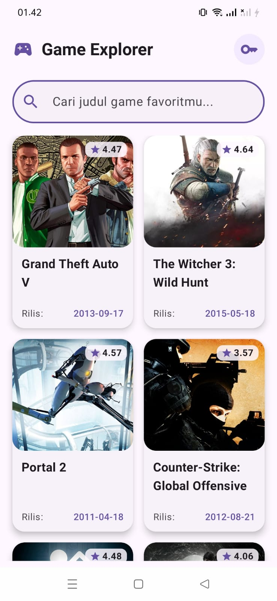
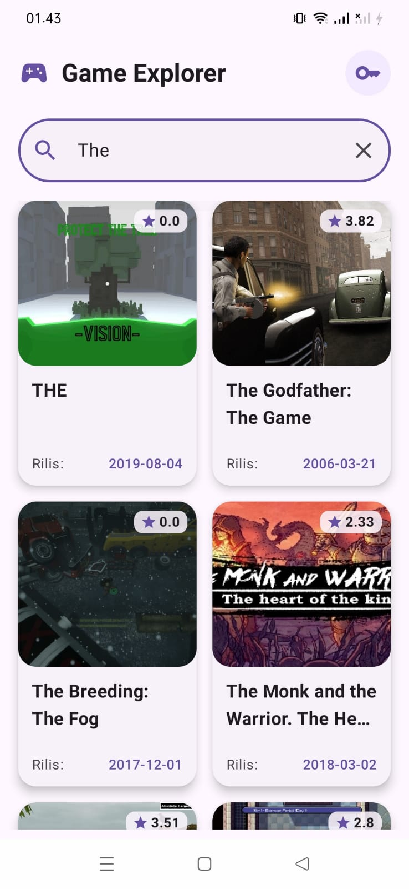
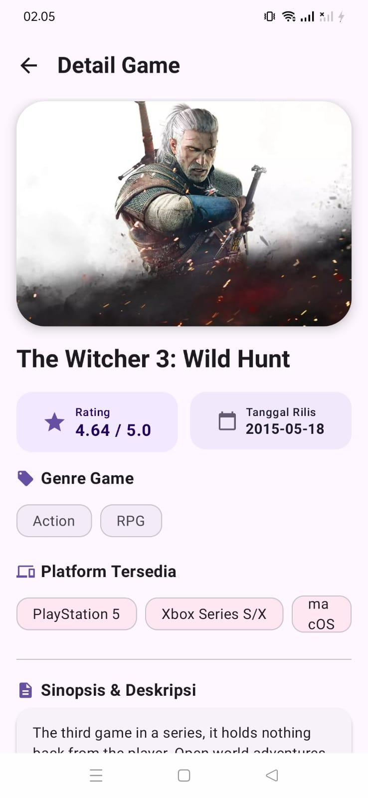

# 🎮 Game Explorer (Katalog dan Eksplorasi Video Game)

[](https://developer.android.com)
[](https://kotlinlang.org)
[](https://developer.android.com/jetpack/compose)
[](https://m3.material.io)
[](https://developer.android.com/topic/architecture)

Aplikasi Android berbasis **Jetpack Compose** dan **Material Design 3** yang dikembangkan untuk memenuhi Ujian Responsi Praktikum Pemrograman Mobile. Aplikasi ini mengambil dan menampilkan data video game secara dinamis dari **RAWG REST API** menggunakan arsitektur **MVVM (Model-View-ViewModel)** yang bersih dan reaktif.

---

## 📋 Daftar Isi
1. [Fitur Utama & Alur Aplikasi](#-fitur-utama--alur-aplikasi)
2. [Checklist Persyaratan Teknis (Rubrik Responsi)](#-checklist-persyaratan-teknis-rubrik-responsi)
3. [Penjelasan Teknis & Arsitektur MVVM](#-penjelasan-teknis--arsitektur-mvvm)
4. [Endpoint REST API yang Digunakan](#-endpoint-rest-api-yang-digunakan)
5. [Pustaka Pendukung & Modul Eksternal (Dependencies)](#-pustaka-pendukung--modul-eksternal-dependencies)
6. [Struktur Proyek](#-struktur-proyek)
7. [Panduan Pengaturan API Key RAWG](#-panduan-pengaturan-api-key-rawg)
8. [Screenshot Aplikasi](#-screenshot-aplikasi)
9. [Cara Menjalankan Proyek](#-cara-menjalankan-proyek)

---

## 📱 Fitur Utama & Alur Aplikasi
1. **Home Screen (Katalog Utama)**:
   - Menampilkan daftar video game dalam bentuk grid 2 kolom menggunakan komponen **`LazyVerticalGrid`**.
   - Setiap kartu game (*Game Card*) memuat poster gambar sampul (*background image*), judul game, rating bintang beserta angka, serta tanggal rilis format ISO 8601.
   - **Search Bar (Pencarian Reaktif)**: Memungkinkan pengguna mengetik nama game untuk melakukan pencarian secara *real-time* tanpa jeda.
   - **Dialog Pengaturan API Key**: Fitur tambahan untuk memasukkan RAWG API Key secara langsung di aplikasi untuk mencegah kegagalan autentikasi (HTTP 401 Unauthorized).
2. **Game Detail Screen (Halaman Detail)**:
   - Menampilkan informasi mendalam saat kartu game diklik.
   - Memuat baner gambar beresolusi tinggi, judul game, rating akurat, tanggal rilis, *chip* genre game, *chip* platform perangkat yang tersedia, serta sinopsis/deskripsi lengkap yang diparsing bersih dari format HTML.
   - Navigasi transisi halaman yang mulus menggunakan **Jetpack Navigation Compose**.

---

## ✅ Checklist Persyaratan Teknis (Rubrik Responsi)

| No | Persyaratan Teknis Soal | Status | Detail Implementasi pada Kode |
| :--- | :--- | :---: | :--- |
| **a.** | **Bahasa Pemrograman (Kotlin)** <br>• Data class, null safety, lambda | **Terpenuhi** | Menggunakan Kotlin, *Data Class* (`GameDto`, `GameResponse`), *Null Safety* (`?`, `?:`), dan *Lambda Expressions* pada Compose & Coroutines. |
| **b.** | **User Interface** <br>• i. Jetpack Compose<br>• ii. Material Design 3<br>• iii. Theme & typography | **Terpenuhi** | Menggunakan *composable layout*, komponen Material 3 (`Scaffold`, `TopAppBar`, `Card`, `OutlinedTextField`), serta kustomisasi `Theme` dan `Type.kt`. |
| **c.** | **List dan Data** <br>• Lazy layout (`LazyVerticalGrid`)<br>• Data dari REST API | **Terpenuhi** | Menggunakan **`LazyVerticalGrid`** untuk merender kumpulan data video game yang diambil secara dinamis dari RAWG API. |
| **d.** | **State & Recomposition** <br>• State-driven UI<br>• i. Search functionality | **Terpenuhi** | Menerapkan pengelolaan state reaktif via `StateFlow` & `collectAsState`, serta fitur pencarian (*search bar*) reaktif. |
| **e.** | **Networking (RAWG API)** <br>• API Keys & Dokumentasi<br>• Nama, Rating, Tanggal rilis ISO 8601, Deskripsi | **Terpenuhi** | Mengintegrasikan RAWG API (`https://api.rawg.io/api/`). Menampilkan nama game, rating angka, tanggal rilis format ISO 8601, dan deskripsi. |
| **f.** | **Architecture (MVVM)** <br>• Retrofit, repository, dll | **Terpenuhi** | Menerapkan arsitektur **MVVM** ketat (Retrofit `ApiService`, `GameRepository`, `GameViewModel`, dan Compose UI). |
| **g.** | **Screens** <br>• i. Home Screen (judul, rating, search bar)<br>• ii. Game Detail Screen (judul, rating, deskripsi) | **Terpenuhi** | **Home Screen**: Judul, rating, tanggal rilis, search bar.<br>**Game Detail Screen**: Judul, rating, tanggal rilis, genre, platform, dan deskripsi game. |

---

## ⚙️ Penjelasan Teknis & Arsitektur MVVM
Aplikasi ini menerapkan pola arsitektur **MVVM (Model-View-ViewModel)** secara konsisten untuk memastikan pemisahan tanggung jawab (*separation of concerns*) yang bersih:

1. **Model & Data Layer**:
   - `GameDto` & `GameResponse`: Representasi struktur data JSON dari RAWG API dalam bentuk Kotlin *data class*.
   - `ApiService`: Interface Retrofit yang mendeklarasikan fungsi *suspend* untuk memanggil endpoint API (`getGames` dan `getGameDetail`).
   - `GameRepository`: Menjembatani pengambilan data dari *network source* dan membungkus respons menggunakan `Result<T>` untuk penanganan error yang aman.
2. **ViewModel Layer**:
   - `GameViewModel`: Menyimpan dan mengelola state UI (`gamesState`, `detailState`, `searchQuery`, `apiKey`). Menjalankan operasi pemanggilan data secara asinkron menggunakan Kotlin *Coroutines* (`viewModelScope.launch`).
3. **UI Layer**:
   - `HomeScreen` & `GameDetailScreen`: Fungsi *Composable* yang bersifat reaktif terhadap perubahan *StateFlow* dari ViewModel.

---

## 🌐 Endpoint REST API yang Digunakan
Base URL: `https://api.rawg.io/api/`

1. **Get Games List / Search**:
   - `GET /games?key={API_KEY}&search={QUERY}`
   - Mengambil daftar game atau hasil pencarian berdasarkan kata kunci.
2. **Get Game Detail**:
   - `GET /games/{id}?key={API_KEY}`
   - Mengambil detail informasi lengkap berdasarkan ID game tertentu.

---

## 📦 Pustaka Pendukung & Modul Eksternal (Dependencies)
Pengembangan aplikasi ini mengintegrasikan berbagai pustaka (*libraries*) modern ekosistem Android guna menjamin performa, kestabilan, serta kemudahan pengelolaan basis kode (*codebase*):
- **Jetpack Compose BOM & Material 3**: Kerangka kerja antarmuka (*UI toolkit*) deklaratif untuk membangun tampilan responsif berstandar Material Design 3.
- **Lifecycle & ViewModel Compose**: Pustaka manajemen daur hidup (*lifecycle*) dan penyimpanan *state* UI secara aman terhadap konfigurasi perubahan layar.
- **Navigation Compose**: Komponen navigasi deklaratif untuk mengatur perpindahan antar layar secara terstruktur.
- **Retrofit 2 & Gson Converter**: Pustaka klien HTTP standar industri untuk menangani komunikasi jaringan REST API dan pemetaan JSON secara otomatis.
- **OkHttp Logging Interceptor**: Pemantau lalu lintas jaringan untuk keperluan *debugging* dan pemantauan HTTP *request/response* secara *real-time*.
- **Coil Compose**: Pustaka pemuatan gambar berbasis Kotlin *coroutines* yang ringan, efisien, serta dioptimalkan khusus untuk Jetpack Compose.

---

## 📂 Struktur Proyek
```text
com.pemmob.gamecatalog/
│
├── data/
│   ├── model/          # GameDto, GameResponse, PlatformDto, GenreDto
│   ├── network/        # ApiService, RetrofitClient
│   └── repository/     # GameRepository
│
├── ui/
│   ├── navigation/     # NavGraph & Screen routes
│   ├── screen/         # HomeScreen, GameDetailScreen, GameCard
│   ├── theme/          # Theme, Color, Type (Material 3)
│   └── viewmodel/      # GameViewModel & UiState
│
└── MainActivity.kt
```

---

## 🔑 Panduan Pengaturan API Key RAWG
1. Kunjungi [https://rawg.io/apidocs](https://rawg.io/apidocs) dan buat akun gratis untuk mendapatkan API Key Anda.
2. Buka aplikasi di perangkat/emulator, lalu tap **ikon Kunci (🔑)** di sudut kanan atas Home Screen.
3. Masukkan API Key Anda pada dialog yang muncul, lalu tap **"Simpan & Muat Ulang"**.

---

## 📸 Screenshot Aplikasi

<p align="center">
  <table border="1" cellspacing="0" cellpadding="8" width="100%" style="border-collapse: collapse;">
    <tr>
      <th align="center" width="33%"><b>Home Screen</b></th>
      <th align="center" width="33%"><b>Fitur Pencarian</b></th>
      <th align="center" width="33%"><b>Game Detail Screen</b></th>
    </tr>
    <tr>
      <td align="center" width="33%">Menampilkan grid katalog game awal dengan penjelasan singkat</td>
      <td align="center" width="33%">Fitur pencarian game secara <i>real-time</i></td>
      <td align="center" width="33%">Menampilkan informasi detail, rating, genre, platform, dan deskripsi</td>
    </tr>
    <tr>
      <td align="center" width="33%"></td>
      <td align="center" width="33%"></td>
      <td align="center" width="33%"></td>
    </tr>
  </table>
</p>

---

## 🚀 Cara Menjalankan Proyek
1. Clone atau download repository ini ke komputer lokal Anda.
2. Buka aplikasi **Android Studio** (disarankan versi Koala, Jellyfish, atau terbaru).
3. Pilih *Open an Existing Project* dan arahkan ke folder proyek ini.
4. Tunggu proses **Gradle Sync** selesai secara otomatis.
5. Hubungkan perangkat Android fisik (aktifkan USB Debugging) atau jalankan Virtual Device (Emulator dengan API level minimal 29).
6. Klik tombol **Run (▶)** di Android Studio untuk melakukan build dan menjalankan aplikasi.

---
*Dibuat untuk memenuhi Ujian Responsi Praktikum Pemrograman Mobile.*
